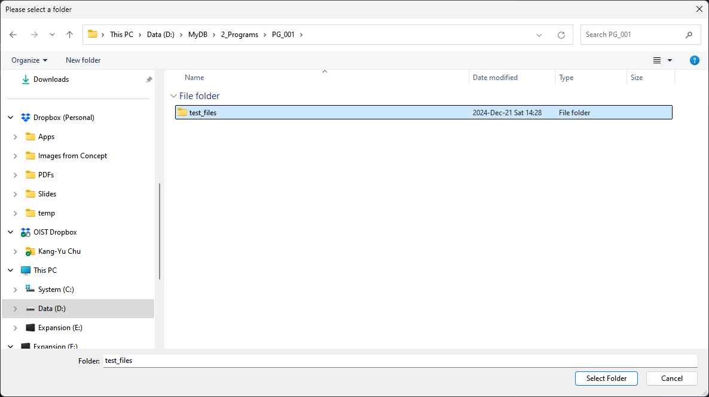
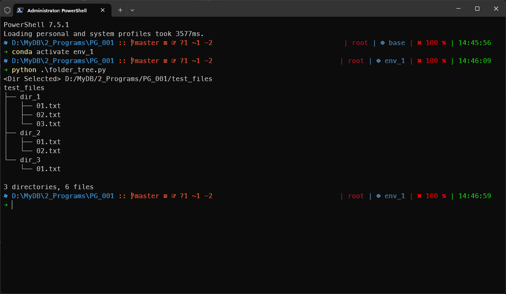

# Introduction
## Execution Steps
1. Run the python file in the terminal, and then a dialog requesting path with show up
2. Select a folder
3. The tree will be printed in the terminal window

# References
Applied the function from the URL below:
[traversal - List directory tree structure in python? - Stack Overflow](https://stackoverflow.com/questions/9727673/list-directory-tree-structure-in-python)

# Editing Logs
## 2025-May-08
- Remove duplicate markdown file (the long-named one). Keep only the markdown named "README.md" since GitHub recognize this filename as default description file.
- Increase more details about the program
- Update on the program
	- change filename to folder_tree.py
	- fix the caption (title) of the popup dialog
