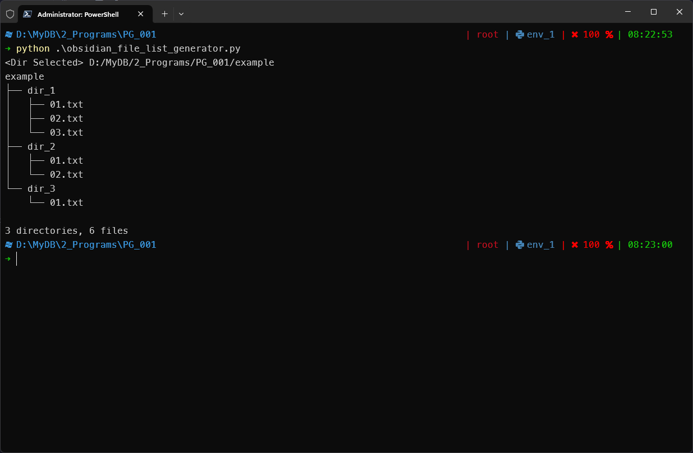

# Results

# MEMO
Applied the function from the URL below:
[traversal - List directory tree structure in python? - Stack Overflow](https://stackoverflow.com/questions/9727673/list-directory-tree-structure-in-python)
